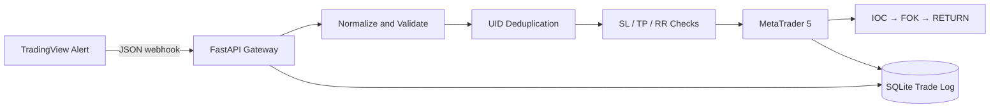

# TradingView–MT5 Execution Bridge

A local-first execution service that receives structured TradingView webhooks, validates trade instructions, prevents duplicate execution, records events in SQLite, and routes eligible market orders to MetaTrader 5.

> This repository contains execution infrastructure only. It does not include proprietary entry logic, market-regime rules, or strategy parameters.

## 中文简介

这是一个本地优先的 TradingView → FastAPI → SQLite → MetaTrader 5 自动执行桥。它负责接收结构化 Webhook、标准化字段、订单去重、SL/TP 与实际风险收益比校验、MT5 下单以及交易日志留存。

公开仓库只展示执行基础设施，不包含完整交易策略、精确市场状态阈值或核心参数。

## Core capabilities

- FastAPI webhook endpoint and health check
- Structured JSON payload normalization
- UID-based duplicate-order protection
- Mandatory stop-loss and take-profit checks
- Minimum realized risk/reward filter
- MT5 filling-mode retry: IOC → FOK → RETURN
- SQLite audit trail for accepted, rejected, skipped, and filled signals
- Background execution so TradingView receives a fast acknowledgement

## Architecture



## Requirements

- Windows 10/11
- Python 3.11 or 3.12
- MetaTrader 5 desktop terminal installed and logged in
- Trading permission enabled in MT5

The official `MetaTrader5` Python package is Windows-oriented, so the full order-routing path is not intended to run on macOS or Linux.

## Quick start

```powershell
py -3.11 -m venv .venv
.venv\Scripts\Activate.ps1
python -m pip install --upgrade pip
python -m pip install -r requirements.txt
copy .env.example .env
python -m uvicorn app.main:app --host 127.0.0.1 --port 8000
```

Open Swagger:

```text
http://127.0.0.1:8000/docs
```

Health check:

```text
GET http://127.0.0.1:8000/ping
```

## Webhook example

Send `examples/webhook.example.json` to:

```text
POST /webhook
```

Required header:

```text
X-Webhook-Secret: your-secret
```

The service rejects order endpoints until `WEBHOOK_SECRET` is configured. It should still be bound to localhost during development and placed behind HTTPS before internet exposure.

## Database

Runtime events are written to:

```text
database/trades.db
```

The database file is intentionally excluded from Git. The schema records payload fields, execution status, MT5 return codes, fill price, errors, and timestamps.

## Public / private boundary

**Public:** webhook gateway, validation flow, duplicate protection, SQLite logging, MT5 routing.

**Private:** strategy source code, exact regime thresholds, proprietary entry parameters, and live credentials.

## Roadmap

- External risk configuration
- Position and pending-order dashboards
- Telegram operator controls
- Windows CI with mocked MT5 execution
- HTTPS + Nginx production deployment

## Disclaimer

For research and engineering demonstration only. Test on a demo account before any production use.
