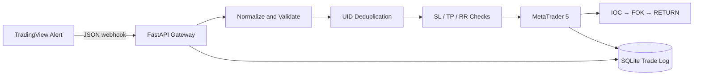

# Architecture

```mermaid
flowchart LR
    TV[TradingView Alert] -->|JSON webhook| API[FastAPI Gateway]
    API --> VALIDATE[Normalize and Validate]
    VALIDATE --> DEDUPE[UID Deduplication]
    DEDUPE --> RISK[SL / TP / RR Checks]
    RISK --> MT5[MetaTrader 5]
    MT5 --> RETRY[IOC → FOK → RETURN]
    API --> DB[(SQLite Trade Log)]
    MT5 --> DB
```
